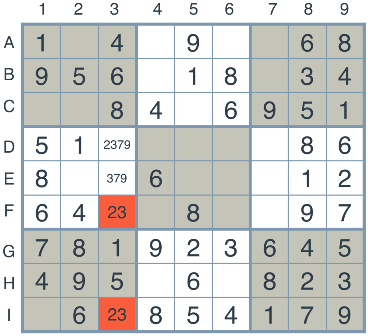
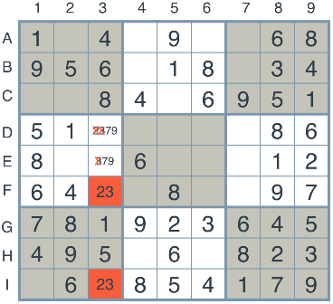
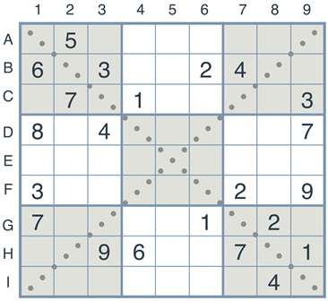

# Artificial Intelligence Nanodegree
## Introductory Project: Diagonal Sudoku Solver
This project includes two tasks. The first one is sovlering naked twin sudoku with constrained propogation method, and the second is diagnoal sudoku, which among the two main diagonals, the numbers 1 to 9 should all appear exactly once.

# 1. naked twins
The naked twins is showed as following. Consider the following puzzle, and look at the two boxes 'F3' and 'I3'.

As shown above, boxes 'F3' and 'I3' belong to same column with same digits. So that, '2' and '3' should be only filled into 'F3' or 'I3', The other boxes with '2' or/and 3 should be removed. 

As you can see, we've removed the values 2 and 3 from the boxes 'D3' and 'E3'. This is the naked twins technique. 

Question
Q: How do we use constraint propagation to solve the naked twins problem?  
A: We search the squares whoes length equals 2 and with same digits in one unit. And then eliminate the two digits from other squares in the same unit. By applying this operation to all of naked twin, that is constraint propogation, we can reach the goal of solution.

# 2. Diagnoal sudoku
A diagonal sudoku is like a regular sudoku, except that among the two main diagonals, the numbers 1 to 9 should all appear exactly once.

Question
Q: How do we use constraint propagation to solve the diagonal sudoku problem?  
A: Comparing with general sudoku problem, we can sovlering diagnoal sudoku by adding the two main dignals to the unit list. 

# 3. Run the program
For running general sudoku, please run solution.py.

For verifying naked twins and diagnoal sudoku, please run solution_test.py
